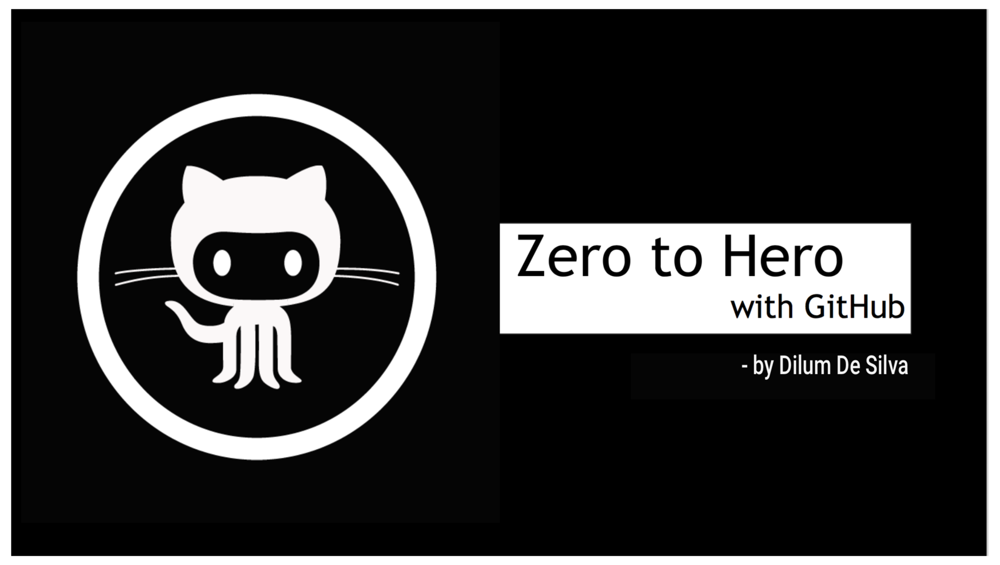
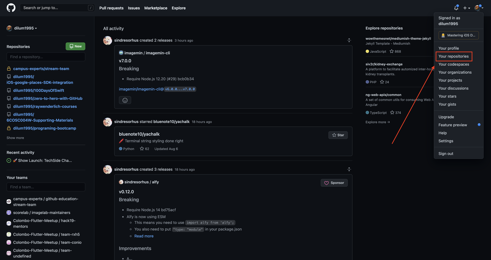
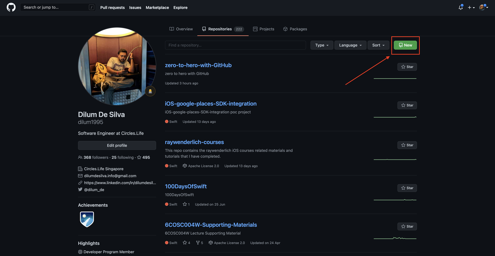
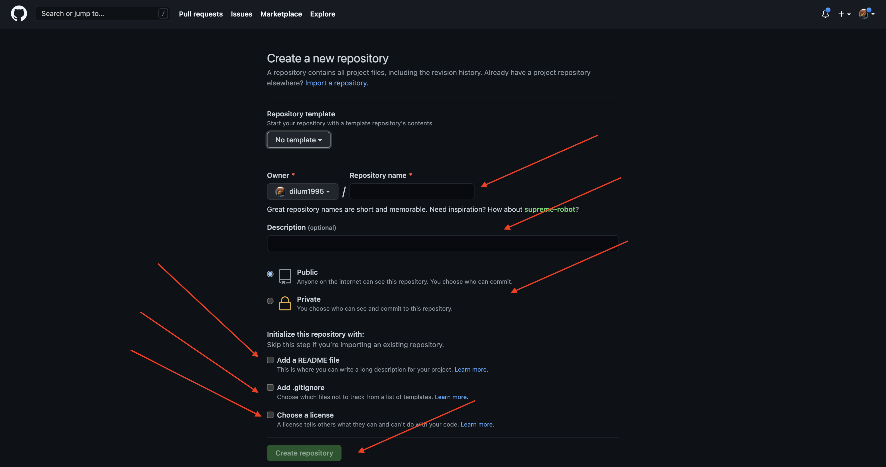

  

# zero-to-hero-with-GitHub

  

This is a hands-on session to help the ****anyone**** to get familiar with GitHub. This session is based on following activities.

  

1) What is ****GitHub****?.

2) My first ****GitHub Repository****.

3) How to maintain a project with GitHub
  - My first ****Star****

  - My first ****Fork****

  - My first ****Clone/Download****

  - My first ****Commit****

  - My first ****Push****

4) How to collaboratively maintain a project with GitHub

5) Other resources

  

<br><br>

  

## What is ****GitHub****?.

GitHub is a web-based hosting service for version control using git. It is mostly used for computer code. It offers all of the distributed version control and source code management functionality of Git as well as adding its own features.

  

****Founder:**** Tom Preston-Werner<br>

****Founded:**** 2008<br>

****Headquarters:**** San Francisco, California, United States<br>

  

<br>

  

## My first ****GitHub Repository****.

In order to create repositories (aka repos) you need to create GitHub account first. To create an account you can visit [www.github.com](www.github.com) and signup. 


<i>when you signup you can use your student email provided your university or school to claim whole bunch or other benifits including [GitHub student developer pack](https://education.github.com/pack) </i>

### From where I can find my repositories


### Click on new button to create a new repository


### Fill the necessary fields related to your repository/project before create the project



## My first ****GitHub Star and Fork****


## My first ****GitHub Clone and Download****


## ****To use git you need to install git on your computer****

Before you start with git commands you have to make sure that you have install git in your computer. You can simply run following command to check whether you have installed git into your computer or not.

```
git --version
```

If you have installed git, once you run this command it will show you your current git version of your computer. If not you can vist following link and install git to your computer.

  

[Download git,](https://git-scm.com/downloads)


## My first ****GitHub Commit****

Once you dowload and make changes or modifications to the project next step is commit changes to your remote git server. To do that you can follow below mentioned steps.

* navigate in to the project directory as the first step.

* write ****git status**** command to check whether your changes have been captured.

* write ****git add .**** command to add all the captured changes to your remote git server.

```
cd project_directory
git status
git add .
```

## My first ****GitHub Push****

This step will help you to upload all your recently made changes to the online git repository. To do that you have to enter ****git push**** command.

```
git push
```

## Other resouces

- [Session slides](http://bit.ly/ZeroToHeroWithGitHub)
- [Git Cheat sheet](https://education.github.com/git-cheat-sheet-education.pdf)
